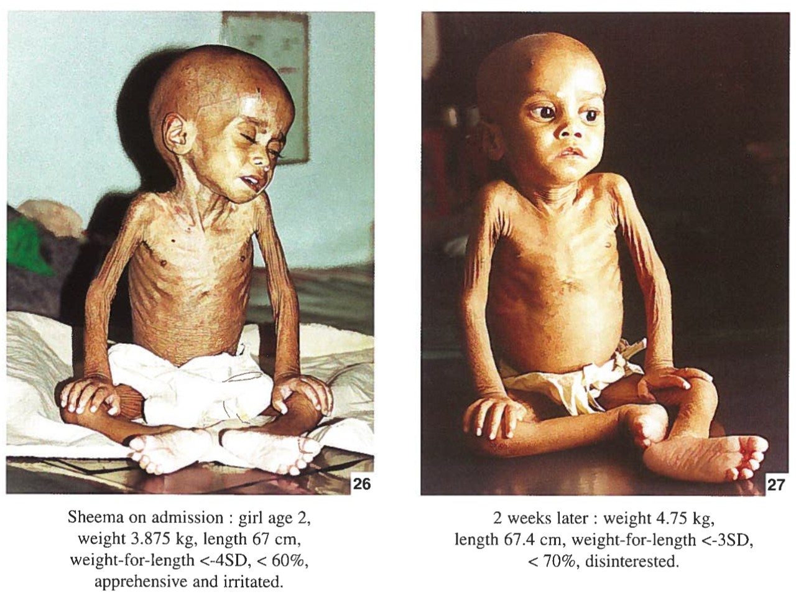
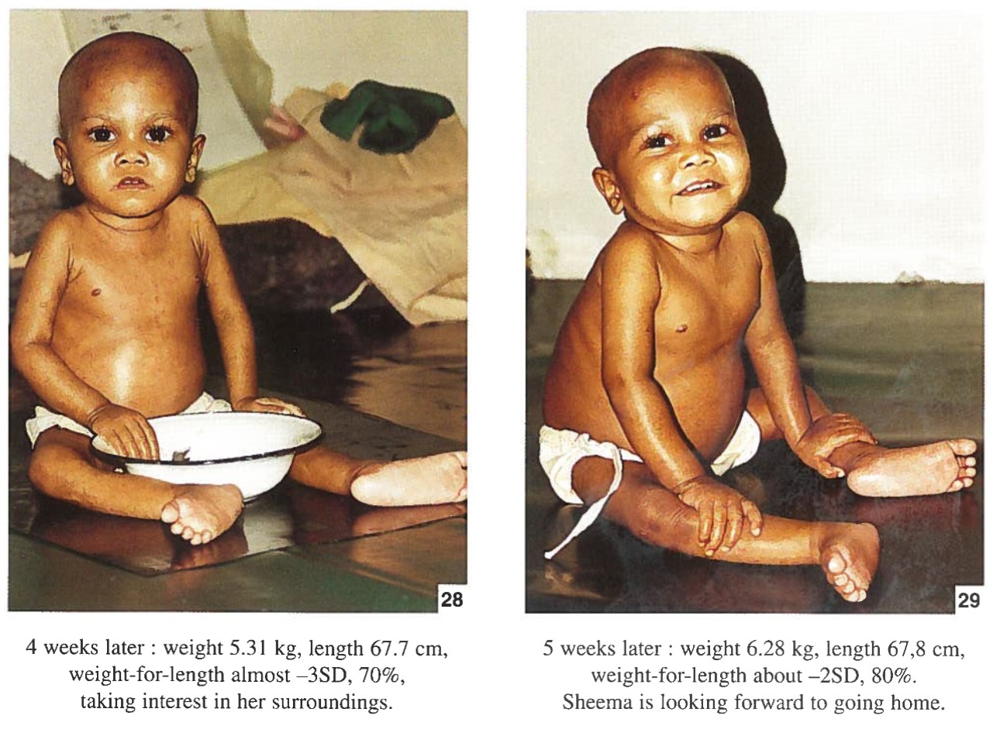

## Recap of Lecture 1 {.smaller}

:::: {.columns}
::: {.column width="55%"}
- Malnutrition is a **spectrum**: undernutrition, micronutrient deficiency, and overnutrition — the **double burden** is now the Indian reality
- **NFHS-6 (2023–24):** stunting ↓ to 29.3%, severe wasting ↓ to 5.2%, but **wasting plateaued** (~19%) and exclusive breastfeeding **fell** to 55.8%
- Causation is **multifactorial** — the UNICEF framework's immediate, underlying, and basic causes — so the response must be **multisectoral**
:::
::: {.column width="45%"}

:::
::::

::: {.notes}
This is the "till slide 24 of Lecture 1" recap. Keep it to ~3 minutes — enough to reactivate the spectrum, the NFHS-6 headline, and the causal framework, since all three underpin today's clinical forms, assessment, and programmes. ~3 min.
:::

---

## Learning Objectives

By the end of this session, you should be able to:

1. Classify protein-energy malnutrition and differentiate marasmus from kwashiorkor
2. Recognise the major micronutrient deficiencies and "hidden hunger"
3. Select appropriate community-level tools for nutritional assessment (ABCD)
4. Outline the facility- and community-based management of SAM (WHO 2023)
5. Describe India's national nutrition programmes and surveillance

::: {.notes}
These map directly to your formative MCQs at the end and to likely SAQs. ~1 min.
:::

---

## Roadmap for Today

Forms of undernutrition (PEM) → Micronutrient deficiencies → Nutritional assessment → **a clinical case** → Management (facility & community) → Micronutrient & lifecycle programmes → National programmes (POSHAN 2.0)

::: {.notes}
Set expectations: the first half completes the "what is it / how do we measure it" story from L1; the second half is "what do we do about it." ~1 min.
:::

---

# Forms of Undernutrition (PEM) {.inverse background-color="#1a3a5c"}

**Section 1**

---

## Protein-Energy Malnutrition (PEM)

A spectrum of clinical conditions resulting from inadequate energy and/or protein intake, presenting as three recognisable syndromes:

1. Marasmus
2. Kwashiorkor
3. Marasmic-kwashiorkor (mixed features)

::: {.notes}
Transition slide into the clinical classification section. ~1 min.
:::

---

## Marasmus

- Severe wasting of muscle and subcutaneous fat
- Characteristic "old man" or wizened facies
- Marked growth retardation
- No oedema
- Child typically alert and irritable, rather than apathetic

::: {.notes}
Show clinical teaching image here (see WHO training-course photograph annexes for consented material). Emphasize the "no oedema, alert" combination as the key distinguishing feature from kwashiorkor. ~3 min.
:::

---

## Kwashiorkor

- Bilateral pitting oedema, the clinical hallmark
- Flaky-paint dermatosis
- Hair changes (sparse, discoloured, easily pluckable)
- Moon face; hepatomegaly (fatty liver)
- Child typically apathetic, rather than irritable

::: {.notes}
Show clinical teaching image. The oedema is the single most important differentiator — test this explicitly in your formative MCQ later. ~3 min.
:::

---

## Marasmus vs Kwashiorkor vs Marasmic-Kwashiorkor

| Feature | Marasmus | Kwashiorkor |
|---|---|---|
| Oedema | Absent | Present (bilateral, pitting) |
| Muscle/fat wasting | Marked | Variable, may be masked by oedema |
| Mental state | Alert, irritable | Apathetic |
| Hair/skin changes | Uncommon | Common |
| Liver | Normal | Enlarged (fatty) |

Marasmic-kwashiorkor: severe wasting with oedema, features of both.

::: {.notes}
Use this comparison table as the anchor for exam prep — this exact table format is a common SAQ. ~2 min.
:::

---

## Why Do We Classify Malnutrition?

- Standardises severity: guides referral decisions and the treatment pathway
- Enables surveillance and comparison across time and between populations
- Different systems exist because they were developed for different purposes and eras; you need to recognise all of them

::: {.notes}
Brief transition before working through the four classification systems. ~1 min.
:::

---

## Gomez Classification

Based on weight-for-age, expressed as a percentage of the reference median:

| Grade | % of reference median weight-for-age |
|---|---|
| Grade I (mild) | 75–90% |
| Grade II (moderate) | 60–75% |
| Grade III (severe) | <60% |

Limitation: cannot distinguish stunting from wasting; a chronically short but proportionate child may be misclassified.

::: {.notes}
Historically important — one of the earliest classification systems (1956). Emphasize the limitation, since it's a common exam point. ~2 min.
:::

---

## IAP Classification

- Also based on weight-for-age
- Four grades (I–IV), developed by the Indian Academy of Pediatrics
- Practical and widely used for community-level growth monitoring in India

::: {.notes}
Keep brief — mainly needs to be recognised and distinguished from Gomez. ~1 min.
:::

---

## Wellcome Classification

Combines weight-for-age with the presence or absence of oedema:

| Weight-for-age | No oedema | With oedema |
|---|---|---|
| 60–80% | Underweight | Kwashiorkor |
| <60% | Marasmus | Marasmic-kwashiorkor |

Advantage over Gomez: it incorporates the clinical sign of oedema, so it distinguishes the PEM syndromes, not only severity.

::: {.notes}
This table is exam-relevant — make sure students can reconstruct it. ~2 min.
:::

---

## WHO Classification (Z-Scores)

The current international standard, using standard-deviation (z-) scores from the WHO Child Growth Standards:

- WHZ (weight-for-height z-score): wasting
- HAZ (height-for-age z-score): stunting
- WAZ (weight-for-age z-score): underweight

Severity cut-offs (apply to all three indices):

- Moderate: < -2 SD
- Severe: < -3 SD

::: {.notes}
Show the normal distribution curve with -2SD/-3SD marked. This is the system used in all current clinical and programmatic guidelines — spend real time here. ~3 min.
:::

---

## Defining Severe Acute Malnutrition (SAM)

A child (6–59 months) has SAM if **any one** of the following is present:

- WHZ < -3 SD, **or**
- MUAC < 11.5 cm, **or**
- Bilateral pitting oedema

Any single criterion is sufficient; the child does not need to meet all three.

::: {.notes}
This is one of the most exam-testable facts in the whole lecture. Repeat it: ANY ONE criterion. ~2 min.
:::

---

## SAM vs MAM

| | SAM | MAM |
|---|---|---|
| WHZ | < -3 SD | -3 to -2 SD |
| MUAC | < 11.5 cm | 11.5–12.5 cm |
| Oedema | May be present | Absent |

::: {.notes}
Pair directly with the previous slide. This distinction determines the management pathway covered later today (facility vs community-based care). ~2 min.
:::

---

# Micronutrient Deficiencies {.inverse background-color="#1a3a5c"}

**Section 2**

---

## Vitamin A Deficiency

- The leading cause of preventable childhood blindness worldwide
- Clinical progression: night blindness → Bitot's spots → keratomalacia
- Also increases the severity of infections and childhood mortality, independent of its ocular effects

::: {.notes}
Show a clinical image of Bitot's spots if available (Wikimedia Commons, CC BY-SA). We return to the prophylaxis programme later today. ~2 min.
:::

---

## Iron Deficiency Anaemia

- The single most common micronutrient deficiency worldwide and in India
- Presents with fatigue, pallor, reduced work capacity, and impaired cognitive development
- Disproportionately affects women of reproductive age and young children; recall the NFHS-5 figures (children ~67%, women ~57%)

::: {.notes}
Link back to the anaemia data from L1. Flag that Anaemia Mukt Bharat (covered later) is the programmatic response. ~2 min.
:::

---

## Iodine Deficiency Disorders (IDD)

- Spectrum: goitre → hypothyroidism → cretinism (irreversible if it occurs in utero or early infancy)
- Cretinism causes irreversible impaired cognitive development
- Entirely preventable through universal salt iodisation

::: {.notes}
Emphasize the "entirely preventable, irreversible if missed" contrast — a strong public-health teaching point. ~2 min.
:::

---

## Other Deficiencies & "Hidden Hunger"

- Zinc: worsens diarrhoea, impairs growth
- Vitamin D: rickets
- B-complex: beri-beri (thiamine), pellagra (niacin)

"Hidden hunger" is micronutrient deficiency without overt wasting or visible undernutrition: a child can look adequately nourished by weight and height alone and still be micronutrient-deficient.

::: {.notes}
"Hidden hunger" is a useful phrase to have students remember verbatim — it captures why anthropometry alone is an incomplete assessment. ~2 min.
:::

---

# Nutritional Assessment {.inverse background-color="#1a3a5c"}

**Section 3**

---

## The ABCD Framework

Four complementary approaches to assessing nutritional status:

- **A**: Anthropometry
- **B**: Biochemical
- **C**: Clinical
- **D**: Dietary

At the population level, add ecological and vital-statistics indicators.

::: {.notes}
Framework slide before going into each component in detail. ~1 min.
:::

---

## Anthropometry

- Measurements: weight, height/length, MUAC, BMI, skinfold thickness
- Derived indices: WAZ, HAZ, WHZ (as covered in the classification section)
- Head circumference: used in children under 2 years

::: {.notes}
Reinforces the WHZ/HAZ/WAZ terminology from the classification section. ~2 min.
:::

---

## Growth Monitoring

- MCP (Mother & Child Protection) card: India's standard tool for serial growth recording
- Plotted against the WHO Child Growth Standards
- Serial measurements matter more than a single reading: plotting over time detects growth faltering early, before a child crosses into SAM/MAM thresholds

::: {.notes}
Show a growth chart with a faltering trajectory if available. Emphasize: growth monitoring is about the *trend*, not a single point-in-time measurement. ~2 min.
:::

---

## MUAC & Oedema: Field Screening

- MUAC tape (colour-coded red/yellow/green) allows rapid community-level screening for SAM/MAM without a weighing scale
- Check for bilateral pitting oedema, graded + (mild), ++ (moderate), +++ (severe)

::: {.notes}
Live demonstration here — bring the MUAC tape and demonstrate correct technique (mid-point between shoulder and elbow, relaxed arm, snug but not tight). Have 2–3 students practice. ~5 min.
:::

---

## Biochemical, Clinical & Dietary Assessment

- Biochemical: haemoglobin, serum proteins, ferritin
- Clinical: examining for specific signs of deficiency (e.g., Bitot's spots, goitre, oedema)
- Dietary: 24-hour dietary recall, food-frequency questionnaire

::: {.notes}
Complete the ABCD framework. Note that in resource-limited field settings, anthropometry and clinical examination are usually the most feasible; biochemical assessment requires laboratory support. ~2 min.
:::

---

# Management of Malnutrition {.inverse background-color="#1a3a5c"}

**Section 4 · From assessment to action**

---

## A Case to Anchor Us

::: {.callout-important appearance="simple"}
A **9-month-old** is brought to your PHC. On screening: **MUAC 10.5 cm** and **bilateral pedal oedema**. The mother says he has had loose stools for three days.

**What now?**
:::

- Does this child have SAM? On which criteria?
- Complicated or uncomplicated?
- Facility or community care?

::: {.notes}
Deliberately place the case *after* the students can define SAM and do a MUAC/oedema assessment. Take answers now, but tell them we return to this exact child at the end. ~2 min.
:::

---

## WHO 2023 Guideline — What Changed {.smaller}

::: {.callout-note appearance="simple"}
WHO **Guideline on the prevention and management of wasting and nutritional oedema** (launched 20 Nov 2023).
:::

- Terminology: **"wasting and nutritional oedema"** now preferred over "acute malnutrition"/"PEM"
- **First guideline to cover both moderate AND severe** wasting together
- Four focus areas: infants <6 months at risk · moderate wasting (6–59 mo) · severe wasting/oedema (6–59 mo) · **prevention**
- New emphasis on **relapse**, caregiver support, and the frontline workforce

::: {.notes}
Students often learn only the 2013 SAM guidance — flag that the framing has shifted and that "moderate + severe in one guideline" is the headline change. ~2 min.
:::

---

## Triage: Which Pathway? {.smaller}

Two questions decide everything: **appetite** (RUTF appetite test) and **medical complications** (danger signs).

```{mermaid}
flowchart TD
  A[Child with SAM] --> B{Appetite test passed<br/>AND no complications?}
  B -->|Yes: uncomplicated| C[Community-based care<br/>Outpatient + RUTF]
  B -->|No: complicated| D[Facility-based care<br/>NRC / inpatient]
```

Complications include: no appetite, severe oedema (+++), infection/danger signs, or age <6 months.

::: {.notes}
This decision tree is the single most useful slide for the case. Uncomplicated SAM with appetite → home with RUTF; complicated → admit. Our case (oedema + diarrhoea, infant) will route to the facility. ~3 min.
:::

---

# Facility-Based Management (NRC) {.inverse background-color="#1a3a5c"}

**Section 4a**

---

## Nutrition Rehabilitation Centre (NRC)

- Inpatient care for **complicated SAM**, failed appetite test, or infants <6 months
- Located at a First Referral Unit / district hospital; **24×7** care
- Combines the WHO 10-step protocol with treatment of the precipitating illness

::: {.notes}
Situate the NRC in the health system — this is where your referred children go. ~2 min.
:::

---

## WHO 10 Steps — Overview

A standardised inpatient protocol delivered across **two phases**: stabilisation, then rehabilitation.

::: {.callout-tip appearance="simple"}
Mnemonic order: correct the life-threatening problems first (hypoglycaemia, hypothermia, dehydration, electrolytes, infection), *then* feed — cautiously at first, then for catch-up.
:::

::: {.notes}
Show the 10-step wheel if you have it. Stress the sequence: you stabilise before you push calories. ~2 min.
:::

---

## 10 Steps (1–3): Resuscitate

1. Treat/prevent **hypoglycaemia**
2. Treat/prevent **hypothermia**
3. Treat/prevent **dehydration** — use **ReSoMal**, cautiously (never standard ORS at full strength)

::: {.notes}
These three are the immediate killers. ReSoMal has lower sodium and higher potassium than standard ORS — appropriate for the SAM child's altered body composition. ~2 min.
:::

---

## 10 Steps (4–6): Correct the Internal Milieu

4. Correct **electrolytes** (give K⁺ and Mg²⁺; restrict Na⁺)
5. Treat **infection** — broad-spectrum antibiotics, even without obvious signs
6. Correct **micronutrients** — **no iron during stabilisation**

::: {.callout-warning appearance="simple"}
Iron is withheld in the stabilisation phase: free iron promotes oxidative stress and bacterial growth. It is added only once the child is in catch-up.
:::

::: {.notes}
The "no iron yet" point is heavily tested — tie it to why. Antibiotics-for-all because the SAM child's infection signs are blunted. ~3 min.
:::

---

## 10 Steps (7–10): Feed & Follow Up

7. **Cautious feeding** — F-75 (stabilisation)
8. **Catch-up growth** — F-100 / RUTF (rehabilitation)
9. **Sensory stimulation** and emotional support
10. **Prepare for follow-up** after discharge

::: {.notes}
Steps 9 and 10 are easy to forget but examinable — malnutrition is developmental as well as nutritional, and discharge without follow-up invites relapse. ~2 min.
:::

---

## The Two Phases

| | Stabilisation | Rehabilitation |
|---|---|---|
| Timing | ~Days 1–7 | From ~week 2 |
| Feed | **F-75** | **F-100 / RUTF** |
| Goal | Correct complications, restore metabolism | Rapid **catch-up** weight gain |
| Iron | Withheld | Added |

::: {.notes}
The phase table plus the "iron withheld → added" row captures most of the exam content. ~2 min.
:::

---

## Therapeutic Foods

- **F-75**: 75 kcal per 100 ml → used to **stabilise** (not for weight gain)
- **F-100**: 100 kcal per 100 ml → used for **catch-up** growth
- **RUTF** (Ready-to-Use Therapeutic Food): energy-dense paste, no water needed, enabling **home-based** treatment of uncomplicated SAM

::: {.notes}
The numbers (75 vs 100 kcal/100 ml) and their roles are a classic MCQ. RUTF is the innovation that made community-based care possible. ~2 min.
:::

---

# Community-Based Management (CMAM) {.inverse background-color="#1a3a5c"}

**Section 4b**

---

## CMAM — Four Components {.smaller}

1. **Community mobilisation** and active case-finding
2. **Outpatient therapeutic care** for uncomplicated SAM
3. **Inpatient care** for complicated SAM
4. **Supplementary feeding** for MAM

::: {.callout-note appearance="simple"}
CMAM shifts most SAM care out of hospitals and into the community; the module is now integrated into POSHAN 2.0.
:::

::: {.notes}
CMAM = Community-based Management of Acute Malnutrition. The key idea: only complicated cases need a bed. ~2 min.
:::

---

## Outpatient Care with RUTF

- Home management of **uncomplicated SAM** in a child who **passes the appetite test**
- Weighed weekly/biweekly at the Anganwadi centre, sub-centre, or Health & Wellness Centre
- Caregiver counselled on RUTF use, hygiene, and danger signs prompting return

::: {.notes}
This is where most SAM is actually managed. Emphasize the appetite test as the gatekeeper to home care. ~2 min.
:::

---

## Discharge & Follow-Up

- Discharge criteria (per protocol): sustained weight gain, **MUAC ≥ 12.5 cm**, and **no oedema**
- Continued growth monitoring after discharge to prevent **relapse** — a WHO 2023 priority
- Link back to routine ICDS/Anganwadi services

::: {.notes}
Relapse prevention is the newly emphasised piece — discharge is not the end of care. ~2 min.
:::

---

# Micronutrient & Lifecycle Programmes {.inverse background-color="#1a3a5c"}

**Section 5 · Prevention across the life course**

---

## Vitamin A Prophylaxis

- **National Vitamin A Prophylaxis Programme**: biannual mega-doses from **9 months to 5 years**
- Therapeutic doses given in measles and xerophthalmia
- Delivered largely through the Anganwadi/immunisation platform

::: {.notes}
Connects the Vitamin A deficiency slide from earlier to its programmatic answer. ~2 min.
:::

---

## Anaemia & Iron

- **Anaemia Mukt Bharat** — the **6×6×6** strategy (6 interventions, 6 target groups, 6 institutional mechanisms)
- Age-specific IFA supplementation (National Iron Plus Initiative) plus **deworming**
- Diet diversification and food fortification

::: {.callout-note appearance="simple"}
NFHS-6 did **not** measure anaemia (haemoglobin testing was dropped); ICMR's DABS-I with venous sampling is awaited.
:::

::: {.notes}
The 6×6×6 label is examinable. Repeat the NFHS-6 data-gap caveat from L1. ~2 min.
:::

---

## Iodine & Zinc

- **Iodine**: universal salt iodisation under the National Iodine Deficiency Disorders Control Programme (NIDDCP)
- **Zinc**: given with **low-osmolarity ORS** for 14 days in childhood diarrhoea — reduces duration and recurrence

::: {.notes}
Zinc + ORS in diarrhoea is a high-yield primary-care fact worth drilling. ~2 min.
:::

---

## The First 1000 Days

::: {.callout-important appearance="simple"}
Conception to age 2 (~1000 days) is the **critical window**. Damage to growth and cognition here is **largely irreversible** — so prevention must be front-loaded.
:::

- Explains why stunting (a chronic, cumulative deficit) is so hard to reverse later
- Prioritise maternal nutrition, breastfeeding, and complementary feeding in this window

::: {.notes}
Tie back to the L1 distinction between chronic (stunting) and acute (wasting). This slide is the conceptual spine of prevention. ~2 min.
:::

---

## Maternal Nutrition

- Maternal **undernutrition, low BMI, and anaemia** → **low birth weight (LBW)**
- Antenatal **IFA** and **calcium** supplementation; dietary support
- **PMMVY** (Pradhan Mantri Matru Vandana Yojana): conditional cash benefit for pregnant/lactating women

::: {.notes}
LBW is the bridge between maternal and child nutrition — and the entry point to the intergenerational cycle on the next slide. ~2 min.
:::

---

## The Intergenerational Cycle (DOHaD) {.smaller}

```{mermaid}
flowchart LR
  A[Undernourished girl] --> B[Small, undernourished mother]
  B --> C[Low-birth-weight baby]
  C --> D[Stunted child]
  D --> A
```

- **Developmental Origins of Health & Disease (Barker hypothesis)**: early-life undernutrition programmes later disease risk
- Breaking the cycle requires investing **before** pregnancy — in girls and adolescents

::: {.notes}
Show the cycle as a loop. The intervention point that breaks it earliest is adolescent nutrition — the next slide. ~2 min.
:::

---

## IYCF Practices

- **Early initiation** of breastfeeding within 1 hour (NFHS-6: 41.8% → 50.1% — improving)
- **Exclusive breastfeeding** to 6 months (NFHS-6: **63.7% → 55.8% — a concerning fall**)
- Timely, adequate, safe **complementary feeding** from 6 months

::: {.notes}
IYCF = Infant and Young Child Feeding. The EBF reversal is the programmatic worry to flag — it echoes the L1 magnitude slide. ~2 min.
:::

---

## Adolescent Nutrition

- **Weekly Iron-Folic Acid Supplementation (WIFS)** for adolescents
- Nutrition and anaemia interventions here **break the intergenerational cycle before pregnancy**
- Complemented by the erstwhile Scheme for Adolescent Girls (now within POSHAN 2.0)

::: {.notes}
Close the loop from the DOHaD diagram: adolescents are the earliest feasible intervention point. ~2 min.
:::

---

# National Nutrition Programmes {.inverse background-color="#1a3a5c"}

**Section 6 · The delivery vehicle**

---

## From ICDS to POSHAN 2.0 {.smaller}

- **ICDS (1975)** → Anganwadi Services → now subsumed under **Mission Saksham Anganwadi & POSHAN 2.0 (2021)**
- POSHAN 2.0 **merges** three schemes:
  - Anganwadi Services (ICDS)
  - POSHAN Abhiyaan
  - Scheme for Adolescent Girls

::: {.callout-important appearance="simple"}
Common exam update — students must know the **lineage** and that ICDS is no longer a standalone programme.
:::

::: {.notes}
This is the update most textbooks lag on. Make students say the three merged schemes aloud. ~2 min.
:::

---

## ICDS / Anganwadi — Six Services {.smaller}

:::: {.columns}
::: {.column width="55%"}
1. Supplementary nutrition
2. Immunisation
3. Health check-up
4. Referral services
5. Nutrition & health education
6. Non-formal pre-school education
:::
::: {.column width="45%"}
**Beneficiaries:**

- Children under 6 years
- Pregnant & lactating women
- Adolescent girls

Delivered at the **Anganwadi centre**.
:::
::::

::: {.notes}
The six services are a guaranteed SAQ. Note three are delivered in convergence with the health system (immunisation, health check-up, referral). ~3 min.
:::

---

## POSHAN 2.0 — Structure {.smaller}

- **Verticals**: Nutrition Support · Early Childhood Care & Education (3–6 y) · Saksham Anganwadi (infrastructure) · POSHAN Abhiyaan
- **Three pillars**: **Convergence · Governance · Capacity-building**
- **Targets**: stunting, wasting, underweight, anaemia, and low birth weight

::: {.notes}
The three pillars and the target set are the examinable core. ~2 min.
:::

---

## PM POSHAN (Mid-Day Meal)

- Hot cooked meal in government and government-aided schools
- Increasingly using **fortified rice**
- Improves **enrolment, attendance, and nutrition** simultaneously

::: {.notes}
Renamed from the Mid-Day Meal Scheme to PM POSHAN (2021). The dual education-plus-nutrition benefit is the teaching point. ~2 min.
:::

---

## Other Schemes at a Glance

| Programme | Target group | Benefit |
|---|---|---|
| Anaemia Mukt Bharat | All age groups | IFA, deworming (6×6×6) |
| PMMVY | Pregnant/lactating women | Conditional cash benefit |
| WIFS | Adolescents | Weekly IFA |
| National Vit A Prophylaxis | 9 mo–5 y | Biannual mega-doses |

::: {.notes}
Use as a consolidation table. Students should be able to map each programme to the lifecycle stage it serves. ~2 min.
:::

---

## Surveillance: Poshan Tracker

- Real-time ICT platform monitoring **10+ crore** beneficiaries across Anganwadi centres
- Records growth measurements, service delivery, and supplementary nutrition
- Population estimates still come from **NFHS** and the **Comprehensive National Nutrition Survey (CNNS)**

::: {.notes}
Distinguish programme monitoring (Poshan Tracker, near-real-time, administrative) from population surveys (NFHS/CNNS, periodic, representative). ~2 min.
:::

---

## Role of the Physician (AETCOM)

- **Screen** every child contact (MUAC, oedema, growth chart) and **refer** appropriately
- **Counsel** on IYCF and household feeding practices
- **Advocate** for equity and intersectoral action: water, sanitation, education, livelihoods
- Treat the child *and* address the underlying and basic causes from the L1 framework

::: {.notes}
This is the AETCOM/attitudes-ethics-communication tie-in: the physician's role spans clinic and community. ~2 min.
:::

---

## Back to Our Case

::: {.callout-important appearance="simple"}
9-month-old · MUAC 10.5 cm · bilateral pedal oedema · 3 days of diarrhoea
:::

- **SAM?** Yes — MUAC < 11.5 cm *and* bilateral oedema (either alone would suffice)
- **Complicated?** Yes — oedema with intercurrent illness (and infant considerations)
- **Pathway:** refer to the **NRC** → WHO 10 steps → **F-75** first (no iron), treat infection, ReSoMal for dehydration → F-100/RUTF for catch-up → discharge on MUAC ≥ 12.5 cm with follow-up

::: {.notes}
Walk the case through the exact framework built today. This is your integrated assessment moment. ~3 min.
:::

---

## Key Takeaways

- PEM presents as marasmus, kwashiorkor, or mixed; **oedema** is the key differentiator, and **SAM = WHZ < -3 / MUAC < 11.5 / oedema (any one)**
- **ABCD** gives a complete assessment; MUAC and oedema enable screening without a scale
- Management follows **WHO 2023**: triage on appetite + complications → NRC (10 steps, two phases) or community RUTF
- Prevention is **lifecycle-wide** — first 1000 days, maternal and adolescent nutrition — delivered through **POSHAN 2.0**

::: {.notes}
Recap slide — go through each point briefly, then the MCQs. ~2 min.
:::

---

## Recovery Is Possible {.smaller}

:::: {.columns}
::: {.column width="50%"}

:::
::: {.column width="50%"}

:::
::::

Sheema, a girl aged 2, was admitted with severe acute malnutrition: weight 3.875 kg, length 67 cm, weight-for-length below -4 SD. After five weeks of guideline-based inpatient care her weight reached 6.28 kg (weight-for-length about -2 SD), and she was ready to go home.

::: {.notes}
Classic WHO "Management of Severe Malnutrition" teaching case. End on this note: SAM is treatable, and the feeding and infection protocols we covered are exactly what achieved it. Source: WHO, Management of Severe Malnutrition. ~1 min.
:::

---

## Formative Questions

1. What is the first therapeutic food given in the **stabilisation** phase?
2. Why is **iron withheld** during stabilisation?
3. Which three schemes did **POSHAN 2.0** merge?

::: {.notes}
Answers: (1) F-75; (2) free iron promotes oxidative stress and bacterial growth in the metabolically compromised child; (3) Anganwadi Services (ICDS), POSHAN Abhiyaan, and the Scheme for Adolescent Girls. ~3 min.
:::

---

## References {.smaller}

- **WHO (2023)** — Guideline on the prevention and management of wasting and nutritional oedema (acute malnutrition) in infants and children under 5; launched 20 Nov 2023.
- **WHO** — Management of Severe Malnutrition; the 10 steps of inpatient care; F-75/F-100/RUTF.
- **MoWCD** — Mission Saksham Anganwadi & POSHAN 2.0 (2021); Poshan Tracker.
- **MoHFW** — Anaemia Mukt Bharat (6×6×6); National Iron Plus Initiative; NIDDCP; NRC/CMAM operational guidelines.
- **NFHS-6 (2023–24)** — IYCF indicators (EBF 55.8%, early initiation 50.1%).
- Park's Textbook of Preventive and Social Medicine (latest edition).

---

## Thank You {.inverse background-color="#1a3a5c"}

Questions and discussion welcome.

*Malnutrition, Lecture 2 of 2 · Community Medicine*
